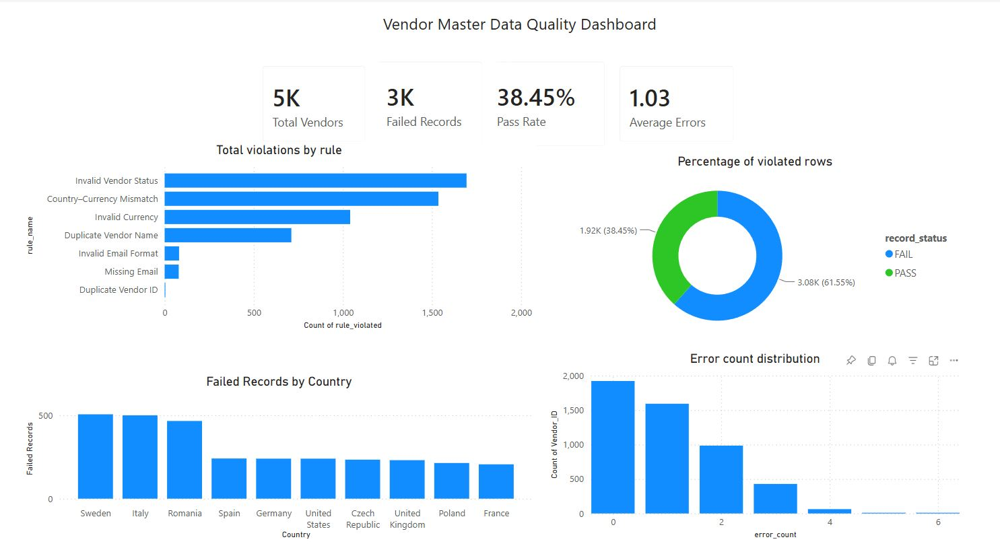

# Vendor Master Data Quality Dashboard (Excel + Power BI)

## Overview

Vendor Master Data Quality Dashboard is a portfolio project that simulates a data quality monitoring solution used in Procurement and Master Data Management (MDM) environments.

The project focuses on validating vendor master records using a set of predefined business rules and presenting data quality metrics in an interactive Power BI dashboard.

The dataset contains **5,000 simulated vendor records** generated for demonstration purposes.

---

## Business Problem

Poor-quality vendor master data can negatively impact procurement and finance processes by causing:

* duplicate supplier records,
* payment delays,
* incorrect reporting,
* inconsistent supplier information,
* additional manual work for procurement teams.

The purpose of this project is to identify common data quality issues and visualize them in a clear, business-oriented dashboard.

---

## Technologies

* Microsoft Excel
* Power BI
* DAX

---

## Dataset

The dataset contains simulated vendor master data with fields such as:

* Vendor ID
* Vendor Name
* Country
* Currency
* Email
* Payment Terms
* Status
* Created Date
* Updated Date

Validation results are stored alongside each record.

---

## Data Validation Rules

The project validates each vendor record using the following business rules:

| Rule | Description                                        |
| ---- | -------------------------------------------------- |
| R1   | Vendor ID must be unique                           |
| R2   | Vendor ID cannot be empty                          |
| R3   | Vendor Name cannot be empty                        |
| R4   | Email cannot be empty                              |
| R5   | Email must have a valid format                     |
| R6   | Country must belong to the approved country list   |
| R7   | Currency must belong to the approved currency list |
| R8   | Currency must match the selected country           |
| R9   | Payment Terms must be valid                        |
| R10  | Vendor Status must be valid                        |
| R11  | Created Date cannot be in the future               |
| R12  | Updated Date cannot be earlier than Created Date   |
| R13  | Duplicate Vendor Name                              |

For each vendor record, the project calculates:

* Error Count
* Record Status (PASS / FAIL)

---

## Power BI Dashboard

The dashboard provides an overview of vendor data quality through several key performance indicators and visualizations.

### KPI Cards

* Total Vendors
* Failed Records
* Pass Rate
* Average Errors per Vendor

### Visualizations

* Total Violations by Rule
* Percentage of Violated Rows
* Failed Records by Country
* Error Count Distribution

The report also supports filtering and exploration of validation results.

---

## Project Structure

```text
Vendor_Master_Data_Quality_Dashboard/
│
├── Excel/
│   └── Vendor_Master_Data.xlsx
│
├── PowerBI/
│   └── Vendor_Master_Data_Dashboard.pbix
│
├── screenshots/
│   └── dashboard_overview.jpg
│
└── README.md
```

---

## Dashboard Preview

  
---

## Project Goals

This project was created to practice concepts commonly used in Procurement Governance and Master Data Management, including:

* data quality validation,
* business rule implementation,
* data analysis,
* KPI reporting,
* dashboard development,
* transforming raw operational data into business insights.

---

## Possible Future Improvements

Potential extensions of the project include:

* implementing the validation process in Power Query,
* automatic refresh of validation results,
* fuzzy duplicate detection for vendor names,
* severity-based error classification,
* vendor quality scoring,
* Power BI drill-through reports,
* integration with SQL or Microsoft Dynamics 365 data sources.

---

## Author

**Szymon Zackiewicz**

This project was developed as part of my portfolio while preparing for internship opportunities in Procurement, Master Data Management and Data Analytics.
